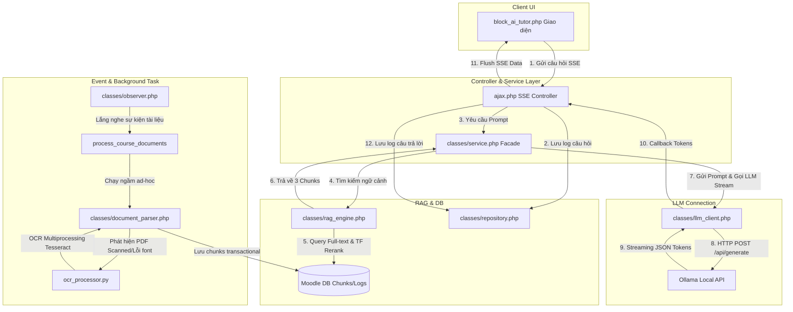

🎓 Moodle AI Tutor Plugin (Block)
==================================

**AI Tutor** là một plugin dạng Block dành cho nền tảng Moodle LMS, được thiết kế để trở thành trợ lý học tập thông minh chạy cục bộ cho sinh viên. Hệ thống sử dụng mô hình ngôn ngữ lớn (LLM) và kỹ thuật RAG (Retrieval-Augmented Generation) để giải đáp thắc mắc của sinh viên dựa trên chính tài liệu bài giảng giảng viên cung cấp trong khóa học.

---

## ✨ Tính năng nổi bật

*   **Local LLM Integration**: Kết nối trực tiếp với API của Ollama để chạy các mô hình nguồn mở (Llama 3.2, Qwen 2.5, Mistral...) ngay trên máy chủ nội bộ, đảm bảo tuyệt đối tính riêng tư và bảo mật dữ liệu.
*   **Event-driven RAG (Real-time Knowledge)**: Tự động hóa hoàn toàn việc nạp tri thức. Hệ thống lắng nghe các sự kiện của Moodle Core (thêm/sửa/xóa tệp tin) để cập nhật chỉ mục cơ sở dữ liệu tri thức tức thì.
*   **Hybrid OCR Text Extraction**: Tích hợp công cụ trích xuất văn bản thông minh. Kết hợp giữa PHP PdfParser (tốc độ cao đối với text layer chuẩn) và Tesseract OCR chạy song song (Python script) nếu phát hiện file PDF là ảnh quét hoặc lỗi font Unicode.
*   **Real-time SSE Streaming**: Giao tiếp qua Server-Sent Events (SSE) giúp phản hồi của AI hiển thị dưới dạng luồng (streaming) giống ChatGPT, giảm độ trễ phản hồi cảm nhận của người dùng.
*   **Ollama Warm-up System**: Cơ chế tự động ping giữ ấm mô hình trong RAM thông qua Windows Task Scheduler (PowerShell script) và kích hoạt nạp trước model ở phía frontend khi tải trang để loại bỏ độ trễ khởi động lạnh (cold-start delay).
*   **Cross-course Linking**: Cho phép liên kết và truy vấn tri thức bổ sung từ các môn học tiên quyết có liên quan.

---

## 📂 Cấu trúc thư mục dự án

```plaintext
ai_tutor/
├── classes/                    # Tầng xử lý logic hướng đối tượng cốt lõi (PHP PSR-4)
│   ├── ajax/                   # Các endpoint API nội bộ cho giao diện Chat
│   │   ├── check_ready.php     # Kiểm tra trạng thái lập chỉ mục của khóa học
│   │   └── warmup_model.php    # Trigger nạp mô hình Ollama vào RAM
│   ├── task/                   # Các Moodle Ad-hoc Tasks chạy ngầm
│   │   ├── process_course_documents.php # Lập chỉ mục tài liệu khóa học
│   │   └── warmup_ollama_model.php      # Giữ ấm mô hình Ollama qua Cron
│   ├── document_parser.php     # Trích xuất văn bản từ PDF (PdfParser & Parallel OCR)
│   ├── llm_client.php          # Quản lý kết nối HTTP API với Ollama
│   ├── observer.php            # Bộ lắng nghe sự kiện của Moodle (Event Observer)
│   ├── rag_engine.php          # Công cụ tìm kiếm ngữ cảnh tối ưu (Full-text & TF Reranking)
│   ├── repository.php          # Tầng lưu trữ dữ liệu (Database CRUD & Log)
│   └── service.php             # Tầng điều phối nghiệp vụ chính (Business Logic Facade)
├── cli/                        # Công cụ dòng lệnh dành cho Quản trị viên
│   ├── benchmark_ram.php       # Đo đạc hiệu năng RAM và tài nguyên RAG
│   ├── force_add_ai_tutor.php  # Deploy tự động block AI Tutor cho toàn bộ khóa học
│   ├── force_index.php         # Yêu cầu lập chỉ mục tức thì cho một khóa học
│   ├── list_courses.php        # Liệt kê thông tin khóa học trong hệ thống
│   └── test_bg.php             # Chạy thử nghiệm background execution
├── db/                         # Định nghĩa cơ sở dữ liệu và cấu hình hệ thống
│   ├── caches.php              # Cấu hình Moodle cache cho context RAG
│   ├── events.php              # Đăng ký các sự kiện Moodle cần lắng nghe
│   ├── install.xml             # Schema chi tiết các bảng CSDL (Chunks, Logs, Deps)
│   ├── tasks.php               # Định nghĩa các Cron Scheduled Tasks
│   └── upgrade.php             # Xử lý cập nhật cấu trúc database qua các phiên bản
├── lang/                       # Bản địa hóa ngôn ngữ hiển thị (en/vi)
│   └── en/
├── scripts/                    # Kịch bản bổ trợ ngoài PHP (Python, PowerShell)
│   ├── ocr_processor.py        # Xử lý OCR PDF song song bằng Python & Tesseract OCR
│   ├── ollama_warmup.ps1       # Script PowerShell ping giữ ấm model trong RAM
│   ├── register_task.ps1       # Tự động hóa đăng ký Task Scheduler trên Windows
│   └── test_speed.php          # Đo tốc độ phản hồi của API Ollama
├── ajax.php                    # Controller API chính xử lý luồng Streaming SSE Chat
├── block_ai_tutor.php          # Lớp khởi tạo block, giao diện Vue/HTML Chat
├── delete_history.php          # Endpoint AJAX để xóa lịch sử trò chuyện của sinh viên
├── manage_links.php            # Giao diện admin thiết lập liên kết khóa học tiên quyết
├── settings.php                # Cấu hình Admin (Ollama URL, Model, Threads, Temp...)
└── version.php                 # Thông tin phiên bản của plugin block
```

---

## 🏛 Chi tiết Kiến trúc Lớp & Codegraph

Dưới đây là chi tiết các lớp cốt lõi và phương thức quan trọng được xây dựng trong hệ thống dựa trên sơ đồ phân tích Code Graph:

### 1. Tầng Điều Phối & API Handler

*   **`ajax.php`**: Nhận request kết nối SSE từ giao diện Chat của sinh viên.
    *   *Tối ưu hóa*: Gọi `session_write_close()` để giải phóng lock session của Moodle ngay lập tức, cho phép sinh viên vừa chat với AI vừa duyệt các bài học khác mà không bị nghẽn mạng.
    *   *Streaming*: Cấu hình tắt buffer đầu ra để flush tức thì các token nhận được từ Ollama về client.
*   **`service`** (`classes/service.php`): Đóng vai trò là Facade điều phối dữ liệu giữa Database, RAG Engine, Parser và LLM Client.
    *   `build_context_prompt($course_id, $user, $question)`: Kết hợp tên môn học, danh sách tài liệu hiện có trong khóa học, dữ liệu trích xuất từ RAG dựa trên câu hỏi và bộ quy tắc ứng xử (System Prompt) để xây dựng cấu trúc prompt tối ưu.
    *   `call_llm_stream($question, $systemPrompt, $callback)`: Chuẩn bị tham số gọi LLM. Tối ưu hóa hiệu năng bằng cách cấu hình số luồng CPU (`num_thread=6`), Context Window (`num_ctx=2048`), và giới hạn câu trả lời học thuật (`num_predict=250`).

### 2. Tầng Trích Xuất Ngữ Cảnh (RAG Engine)

*   **`rag_engine`** (`classes/rag_engine.php`): Chịu trách nhiệm trích xuất thông tin bài học phù hợp nhất với câu hỏi.
    *   `normalize_query($query)`: Chuẩn hóa câu hỏi (loại bỏ dấu câu thừa, chuyển chữ thường, nén khoảng trắng) giúp tăng tỉ lệ tìm thấy cache ngữ cảnh bài giảng.
    *   `get_context($course_id, $query)`:
        *   Kiểm tra ngữ cảnh trong Moodle Cache (`rag_context`). Nếu cache miss, thực hiện truy vấn cơ sở dữ liệu.
        *   **Metadata Boosting**: Tự động cộng điểm tương đồng (`+ 5.0`) cho các chunks thuộc về file tài liệu cụ thể nếu câu hỏi của sinh viên chứa tên file đó (ví dụ: *"tóm tắt file chuong1.pdf"*).
        *   **Full-text Search**: Sử dụng `MATCH AGAINST` (Boolean Mode) để tìm kiếm các phân đoạn tài liệu phù hợp từ MySQL/MariaDB, thực hiện `GROUP BY filename` để đa dạng hóa nguồn tài liệu trích dẫn.
        *   **PHP Reranking (TF - Term Frequency)**: Lấy ra 15 bản ghi tương thích cao nhất, chấm điểm lại dựa trên tần suất từ khóa thực tế và cắt lấy Top 3 chunks tốt nhất.

### 3. Tầng Xử Lý Tài Liệu & OCR

*   **`document_parser`** (`classes/document_parser.php`): Đọc tài liệu khóa học, chia nhỏ văn bản và lập chỉ mục CSDL.
    *   `process_and_save_chunks_for_course($course)`: Quét và xử lý tất cả tệp PDF trong khóa học.
        *   Nếu file PDF có text layer chuẩn: Trích xuất trực tiếp bằng thư viện `Smalot\PdfParser\Parser`.
        *   Nếu phát hiện tỷ lệ ký tự lỗi vượt quá `5%` (`CORRUPTION_THRESHOLD = 0.05`): File được coi là ảnh quét hoặc lỗi font, lập tức đưa vào hàng đợi OCR.
    *   `run_ocr_parallel($ocr_queue)`: Khởi chạy song song tối đa `MAX_PARALLEL_FILES = 3` tiến trình con Python (`ocr_processor.py`) thông qua `proc_open` và lắng nghe đọc luồng dữ liệu bất đồng bộ bằng `stream_select` để tận dụng tối đa số lượng CPU Core (`detect_cpu_cores`).
    *   `chunk_text($text)`: Chia nhỏ văn bản thành các phân đoạn (`1200` ký tự, overlap `150` ký tự).
    *   `save_chunks_to_db($chunks)`: Lưu trữ hàng loạt chunks vào DB trong một `Delegated Transaction` duy nhất để tối ưu hóa thời gian ghi.

### 4. Tầng Giao Tiếp LLM & Database Repository

*   **`llm_client`** (`classes/llm_client.php`): Giao tiếp API HTTP trực tiếp với máy chủ Ollama.
    *   `is_alive()`: Gửi request nhanh tới `/api/tags` với timeout kết nối 2 giây để kiểm tra trạng thái hoạt động của Ollama.
    *   `stream_generation($data, $callback)`: Gửi POST payload tới `/api/generate`. Sử dụng cơ chế bắt luồng dữ liệu (`CURLOPT_WRITEFUNCTION`) kết hợp bộ đệm nội bộ để đảm bảo giải mã JSON đầy đủ trước khi kích hoạt hàm callback truyền dữ liệu về SSE handler.
*   **`repository`** (`classes/repository.php`): Quản lý các câu lệnh SQL tương tác trực tiếp với Database Moodle.
    *   `get_course_activities_summary($course)`: Sử dụng `get_fast_modinfo` của Moodle để lấy nhanh danh sách cấu trúc bài học.
    *   `save_chat_log($userId, $courseId, $role, $message)`: Lưu vết lịch sử trò chuyện.
    *   `auto_purge_old_logs($days = 7)`: Tự động xóa nhật ký trò chuyện cũ hơn 7 ngày bằng câu lệnh xóa một lần để tối ưu hóa không gian CSDL.

### 5. Bộ Quan Sát Sự Kiện & Tác Vụ Chạy Ngầm

*   **`observer`** (`classes/observer.php`): Lắng nghe các sự kiện hệ thống.
    *   `auto_add_ai_block`: Khi một khóa học mới được tạo, tự động chèn instance block AI Tutor vào trang khóa học.
    *   `handle_content_change`: Khi có thay đổi tài liệu (upload, chỉnh sửa, xóa), observer lập tức xóa cache ngữ cảnh RAG (`rag_context`), đăng ký một Ad-hoc task `process_course_documents` vào hàng đợi và kích hoạt tiến trình nền chạy ngay qua CLI command `admin/cli/adhoc_task.php` bằng cơ chế bất đồng bộ (`popen` / `pclose`), giữ cho phản hồi UI luôn mượt mà.
*   **`process_course_documents`** (`classes/task/process_course_documents.php`): Ad-hoc Task của Moodle để chạy ngầm tiến trình parse tài liệu.
    *   *Khả năng chịu lỗi*: Bắt mọi ngoại lệ `\Throwable` phát sinh nhưng chủ động không ném ngược lại để tránh cơ chế tự động retry liên tục của Moodle gây tốn CPU khi gặp file tài liệu bị lỗi cấu trúc nghiêm trọng.
*   **`warmup_ollama_model`** (`classes/task/warmup_ollama_model.php`): Task Cron giữ ấm mô hình Ollama đồng bộ các tham số ngữ cảnh tránh reload KV cache.

---

## 🔗 Bản Đồ Luồng Hoạt Động (Call Graph Relationship)



---

## 🛠 Yêu cầu hệ thống

*   **Moodle LMS**: Phiên bản 4.x trở lên.
*   **PHP**: Phiên bản 8.0 trở lên (yêu cầu các extension: `curl`, `mbstring`, `xml`, `gd`).
*   **Cơ sở dữ liệu**: MySQL 8.0+ hoặc MariaDB 10.4+ (có cấu hình hỗ trợ chỉ mục FULLTEXT trên bảng InnoDB).
*   **Ollama**: Được cài đặt và cấu hình chạy model (mặc định: `http://localhost:11434`).
*   **Python 3**: Cài đặt sẵn (yêu cầu cho tính năng OCR hình ảnh nếu cần quét các tài liệu dạng ảnh). Các thư viện Python cần thiết: `pytesseract`, `pdf2image`, `pillow`.
*   **Tesseract OCR Engine**: Cần cài đặt trên máy chủ hệ thống nếu dùng tính năng OCR.

---

## 🚀 Hướng dẫn cài đặt & Cấu hình

### 1. Cài đặt mã nguồn
1. Sao chép thư mục `ai_tutor` vào đường dẫn thư mục block của Moodle: `{moodle_root}/blocks/ai_tutor`.
2. Truy cập vào thư mục `ai_tutor` và chạy lệnh sau để tải các thư viện Composer phụ thuộc (như `smalot/pdfparser`):
   ```bash
   composer install
   ```

### 2. Kích hoạt Plugin trong Moodle
1. Đăng nhập vào Moodle với tài khoản **Administrator**.
2. Truy cập vào **Site administration > Notifications**. Moodle sẽ phát hiện plugin mới.
3. Chọn **Upgrade Moodle database now** để hệ thống tạo các bảng cơ sở dữ liệu tri thức và log chat.

### 3. Cấu hình Tham số AI
Truy cập vào **Site administration > Plugins > Blocks > AI Tutor** để thiết lập các thông số:
*   **Ollama API URL**: URL của máy chủ Ollama (mặc định: `http://localhost:11434`).
*   **Model Name**: Tên mô hình đã tải sẵn trong Ollama (ví dụ: `llama3.2`, `qwen2.5`).
*   **Max Tokens**: Giới hạn token đầu ra (`num_predict`).
*   **Context Size**: Kích thước context window gửi kèm (`num_ctx`).
*   **Temperature**: Độ sáng tạo của câu trả lời.
*   **Ollama GPU/CPU Threads**: Số lượng luồng xử lý đồng thời (`num_thread`).

### 4. Cấu hình chạy Ollama trên Google Colab (Free GPU)
Nếu máy chủ Moodle cục bộ không có GPU mạnh để chạy mô hình Ollama (như `llama3.2`), bạn có thể sử dụng Google Colab để chạy Ollama miễn phí qua GPU của Google và kết nối tới Moodle thông qua đường truyền Cloudflare Tunnel.

#### Các bước khởi chạy trên Google Colab
Tạo một Notebook mới trên Google Colab (chọn Runtime là **GPU T4**) và chạy các khối lệnh sau:

*   **Khối lệnh 1 (Cài đặt công cụ nén zstd)**:
    ```bash
    !sudo apt-get update && sudo apt-get install -y zstd
    ```
*   **Khối lệnh 2 (Cài đặt Ollama)**:
    ```bash
    !curl -fsSL https://ollama.com/install.sh | sh
    ```
*   **Khối lệnh 3 (Tải và cài đặt Cloudflare Tunnel)**:
    ```bash
    !curl -L https://github.com/cloudflare/cloudflared/releases/latest/download/cloudflared-linux-amd64.deb -o cloudflared.deb
    !dpkg -i cloudflared.deb
    ```
*   **Khối lệnh 4 (Khởi động Ollama và tải mô hình)**:
    ```bash
    %%bash
    export OLLAMA_HOST=0.0.0.0:11434
    export OLLAMA_ORIGINS=*
    ollama serve > ollama.log 2>&1 &
    sleep 5
    cat ollama.log
    
    !ollama pull llama3.2
    ```
*   **Khối lệnh 5 (Khởi chạy Tunnel và lấy địa chỉ API)**:
    ```python
    import subprocess
    import re
    import time

    # Khởi chạy Tunnel trỏ vào Ollama
    tunnel_process = subprocess.Popen(
        ["cloudflared", "tunnel", "--url", "http://127.0.0.1:11434"],
        stdout=subprocess.PIPE,
        stderr=subprocess.STDOUT,
        text=True
    )

    print("Đang kết nối đường truyền Cloudflare Tunnel...")
    time.sleep(5)
    for _ in range(35):
        line = tunnel_process.stdout.readline()
        if not line:
            break
        if "trycloudflare.com" in line:
            url_match = re.search(r"https://[a-zA-Z0-9-]+\.trycloudflare\.com", line)
            if url_match:
                print("\n========================================================")
                print(" KẾT NỐI THÀNH CÔNG! ĐỊA CHỈ API CLOUDFLARE MỚI LÀ:")
                print(url_match.group(0))
                print("========================================================\n")
                break
        time.sleep(0.5)
    ```

#### Cấu hình vào Moodle
1. Sao chép địa chỉ API Cloudflare in ra ở Khối lệnh 5 (ví dụ: `https://xxxx-xxxx-xxxx.trycloudflare.com`).
2. Đăng nhập vào Moodle với tài khoản Admin, truy cập **Site administration > Plugins > Blocks > AI Tutor**.
3. Dán địa chỉ copy được vào mục **Ollama Server URL**.
4. Lưu cấu hình. Trình duyệt Moodle của bạn sẽ tự động kết nối và kích hoạt nạp mô hình vào RAM Google Colab.

---

## 📖 Hướng dẫn sử dụng

### Dành cho Giảng viên
1. Bật chế độ chỉnh sửa khóa học (**Edit mode**) trong trang khóa học Moodle của bạn.
2. Thêm block **AI Tutor** từ danh sách Block ở cột bên phải.
3. Upload các tài liệu học tập (file PDF) lên mục tài nguyên của khóa học. Hệ thống sẽ tự động kích hoạt Ad-hoc Task chạy ngầm để phân tích văn bản và nạp vào kho tri thức của AI.

### Dành cho Sinh viên
1. Sinh viên truy cập vào khóa học sẽ thấy block **AI Tutor** hiển thị ở cột bên phải.
2. Nhấp vào nút **Chat** để mở giao diện trò chuyện. Giao diện sẽ hiển thị đèn tín hiệu báo trạng thái sẵn sàng của mô hình AI:
    *   ⚪ *Đang kiểm tra kết nối...*
    *   🟡 *Đang tải mô hình vào RAM...*
    *   🟢 *AI Tutor đã sẵn sàng trả lời!*
3. Nhập câu hỏi và nhấn gửi. Phản hồi sẽ hiển thị dưới dạng chữ chạy trực tiếp kèm theo trích dẫn cụ thể tên file bài giảng làm nguồn tham khảo.

---

## ⚖️ Giấy phép

Dự án được nghiên cứu và phát triển phục vụ mục đích học tập, cải tiến giảng dạy và nghiên cứu khoa học tại Trường Đại học Nha Trang. Vui lòng tuân thủ các quy định về an toàn dữ liệu nội bộ khi triển khai thực tế.

*   **Author**: Huỳnh Ngọc Long - NTU Student.
